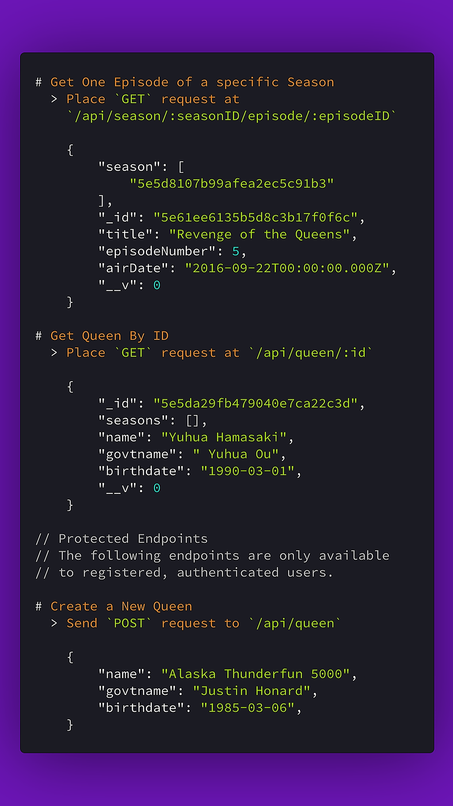

# RuPaul's Drag Race API

> Hey Squirrel Friends! When one database ends, just open up another. Go ahead, I support you 😘 
>
> Look over there! https://shiraamitchell.github.io/rpdr


--------------

Authenticated RESTful API for retrieving information about award-winning reality TV series, RuPaul's Drag Race.  Implemented using **Node.js**, **Express**, and **MongoDB**.

<p align="center">

</p>

# Installing
Clone the repo and navigate to it in Terminal.  To install necessary dependencies (requires [npm](https://npmjs.org/)), run:

```shell
npm install
```

To start the server, use:

```shell
npm start
```

# Usage

This API is still under development.  `GET` requests are available without a key or user-credentials but `POST`, `PUT`, `DELETE` functionality requires users to be to registered and authenticated.

## Basic Endpoints

### Queens 

#### Get All Queens

Place `GET` request at `/api/queen/all`

#### Get Queen By ID

Place `GET` request at `/api/queen/:id`

Sample returned data:
```json
  {
    "_id": "5e5da29fb479040e7ca22c3d",
    "seasons": [],
    "name": "Yuhua Hamasaki",
    "govtname": " Yuhua Ou",
    "birthdate": "1990-03-01T00:00:00.000Z",
    "__v": 0
  }
```

### Seasons

#### Get All Seasons

Place `GET` request at `/api/season/all`

#### Get Season By ID

Place `GET` request at `/api/season/:id`

Sample returned data:
```json
  {
    "episodes": [
      {
        "_id": "5e61b98943eb39b23bf4fbd5",
        "episodeNumber": 1,
        "title": "All Star Talent Show Extravaganza"
      }
    ],
    "queens": [
      {
        "_id": "5e61c29feb0096b730c88cb3",
        "name": "Katya Zamolodchikova"
      },
      {
        "_id": "5e61c7c564fb6bb8fb200366",
        "name": "Alyssa Edwards"
      },
      {
        "_id": "5e61d256e21c9dbcbb035a86",
        "name": "Detox Icunt"
      }
    ],
    "_id": "5e5d8107b99afea2ec5c91b3",
    "seasonNumber": 2,
    "premiereDate": "2015-03-02T00:00:00.000Z",
    "seriesType": "All Stars",
    "__v": 4
  }
```
### Episodes

#### Get All Episodes of a specifc Season

Place `GET` request at `/api/season/:seasonID/episode/`

Sample Returned Data:
```json
[
  {
    "season": [
      "5e5d8107b99afea2ec5c91b3"
    ],
    "_id": "5e61b98943eb39b23bf4fbd5",
    "episodeNumber": 1,
    "title": "All Star Talent Show Extravaganza",
    "airDate": "2016-08-25T00:00:00.000Z",
    "__v": 0
  },
  {
    "season": [
      "5e5d8107b99afea2ec5c91b3"
    ],
    "_id": "5e61ee0635b5d8c3b17f0f69",
    "title": "All Stars Snatch Game",
    "episodeNumber": 2,
    "airDate": "2016-09-01T00:00:00.000Z",
    "__v": 0
  },
  {
    "season": [
      "5e5d8107b99afea2ec5c91b3"
    ],
    "_id": "5e61ee3335b5d8c3b17f0f6a",
    "title": "HERstory of the World",
    "episodeNumber": 3,
    "airDate": "2016-09-08T00:00:00.000Z",
    "__v": 0
  },
  {
    "season": [
      "5e5d8107b99afea2ec5c91b3"
    ],
    "_id": "5e61ee5035b5d8c3b17f0f6b",
    "title": "Drag Movie Shequels",
    "episodeNumber": 4,
    "airDate": "2016-09-15T00:00:00.000Z",
    "__v": 0
  },
  {
    "season": [
      "5e5d8107b99afea2ec5c91b3"
    ],
    "_id": "5e61ee6135b5d8c3b17f0f6c",
    "title": "Revenge of the Queens",
    "episodeNumber": 5,
    "airDate": "2016-09-22T00:00:00.000Z",
    "__v": 0
  }
]
```
#### Get One Episode of a specifc Season

Place `GET` request at `/api/season/:seasonID/episode/:episodeID`

Sample Returned Data:
```json
{
  "season": [
    "5e5d8107b99afea2ec5c91b3"
  ],
  "_id": "5e61ee6135b5d8c3b17f0f6c",
  "title": "Revenge of the Queens",
  "episodeNumber": 5,
  "airDate": "2016-09-22T00:00:00.000Z",
  "__v": 0
}
```

## Protected Endpoints

The following endpoints are only available to registered users.  After login, use JWT token given in `Authorization` header to send `POST`, `PUT`, `DELETE` requests using Postman or otherwise.

Set this in `HEADERS`:

| Key  | Value  |
|---|---|
| Content-Type  | application/json   |
| Authorization  | Bearer *yourtokenhere*   |


### Queens

#### Create a New Queen

Send `POST` request to `/api/queen`

 In Postman `BODY`, select `RAW` and paste in this format: 
```json
{
  "name": "Manila Luzon",
  "govtname": "Karl Philip Michael Westerberg",
  "birthdate": "1981-08-10",
}
```

#### Edit an Existing Queen

Send `PUT` request to `/api/queen/:id`

 In Postman `BODY`, select `RAW` and paste in this format: 
```json
{
  "name": "Alaska Thunderfun 5000",
  "govtname": "Justin Honard"
}
```

#### Delete an Existing Queen

Send `DELETE` request to `/api/queen/:id`

### Season

#### Create a New Season

Send `POST` request to `/api/season/`

In Postman `BODY`, select `RAW` and paste in this format: 
```json
{
  "_id": "5e5d8107b99afea2ec5c91b3",
  "seasonNumber": 2,
  "premiereDate": "2015-03-02T00:00:00.000Z",
  "seriesType": "All Stars"
}
```

#### Edit an Existing Season

Send `PUT` request to `/api/season/:id`

In Postman `BODY`, select `RAW` and paste in this format: 
```json
{
  "_id": "5e5d8107b99afea2ec5c91b3",
  "seasonNumber": 2,
  "premiereDate": "2015-03-02T00:00:00.000Z",
  "seriesType": "All Stars"
}
```

#### Delete an Existing Season

Send `DELETE` request to `/api/season/:id`

### Episodes

Episodes are nested within Seasons.  Use these below routes to perform respective actions

#### Create a New Episode

Send `POST` request to `/api/season/:seasonID/episode/`

 In Postman `BODY`, select `RAW` and paste in this format: 
```json
{
  "_id": "5e5d8107b99afea2ec5c91b3",
  "seasonNumber": 2,
  "premiereDate": "2015-03-02T00:00:00.000Z",
  "seriesType": "All Stars"
}
```

#### Edit an Existing Season

Send `PUT` request to `/api/season/:seasonID/episode/:episodeID`

 In Postman `BODY`, select `RAW` and paste in this format: 
```json
{
  "_id": "5e61b98943eb39b23bf4fbd5",
  "episodeNumber": 1,
  "title": "All Star Talent Show Extravaganza",
  "airDate": "2016-08-25T00:00:00.000Z"
}
```

#### Delete an Existing Season

Send `DELETE` request to `/api/season/:seasonID/episode/:episodeID`
