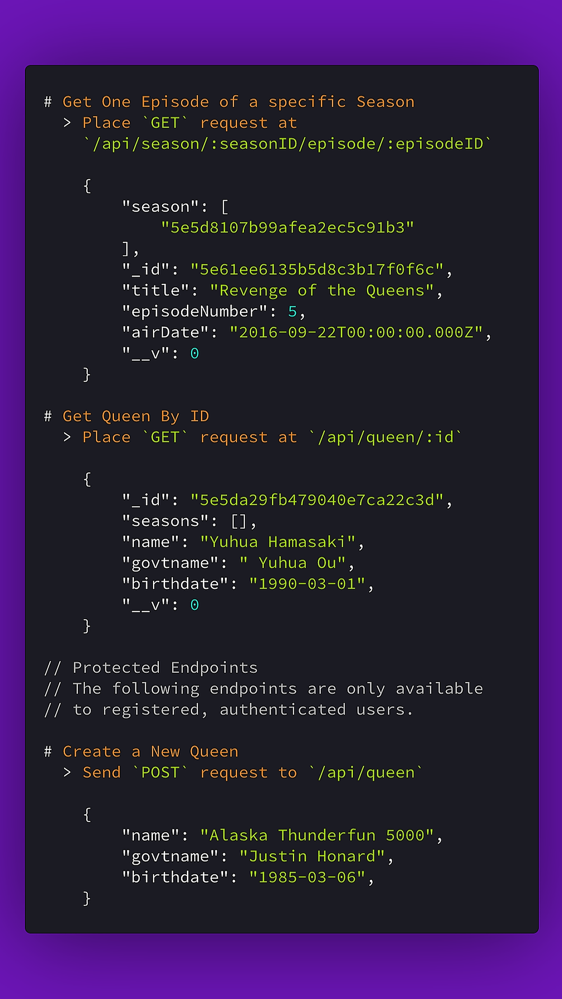

# RuPaul's Drag Race API

Authenticated RESTful API for retrieving information about award-winning reality TV series, RuPaul's Drag Race.    
Implemented using **Node.js**, **Express**, and **MongoDB**.

[GitHub](https://github.com/aucoeur/rpdrAPI)
[Get Started](#installing)
